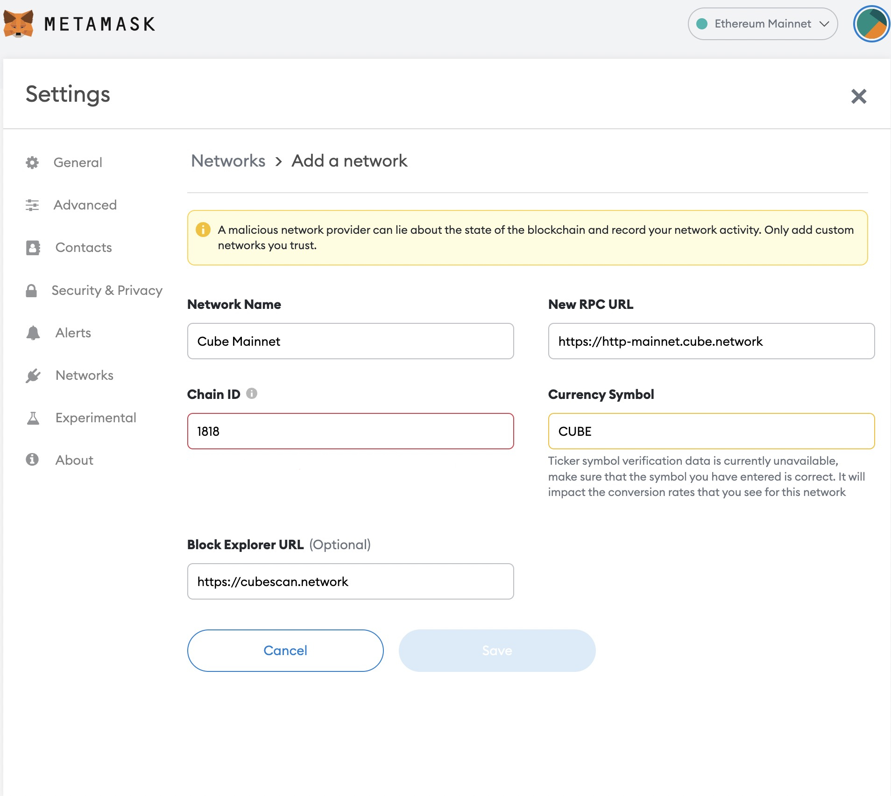

# Summary

Many wallets support CubeChain, such as Metamask, etc.

> NOTE: Check compitibility before using wallet.

# Metamask

Download URL: https://metamask.io/

You can add CubeChain mainnet and testnet to Metamask through [chainlist](https://chainlist.org/).

add custom network manually:

## Mainnet
>TO BE LAUNCH

### chainid
```
1818
```
### rpc

```
https://http-mainnet.cube.network
```

### explorer
```
https://cubescan.network
```



## Testnet

### chainid
```
1819
```
### rpc
> There will be a rate limit. Currently is 50r/s per session/IP .

```
https://http-testnet.cube.network
https://http-testnet-sg.cube.network
https://http-testnet-jp.cube.network
https://http-testnet-us.cube.network
```
### explorer
```
https://testnet.cubescan.network
```


# Coint type for Cube

https://github.com/satoshilabs/slips/blob/master/slip-0044.md